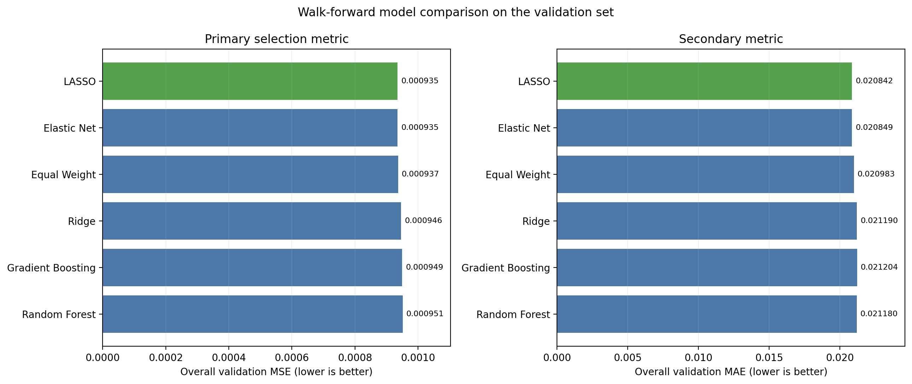
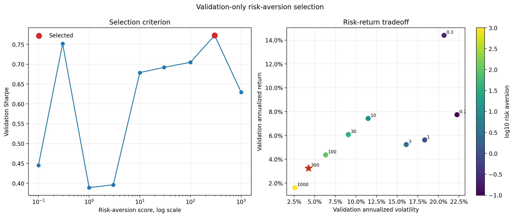
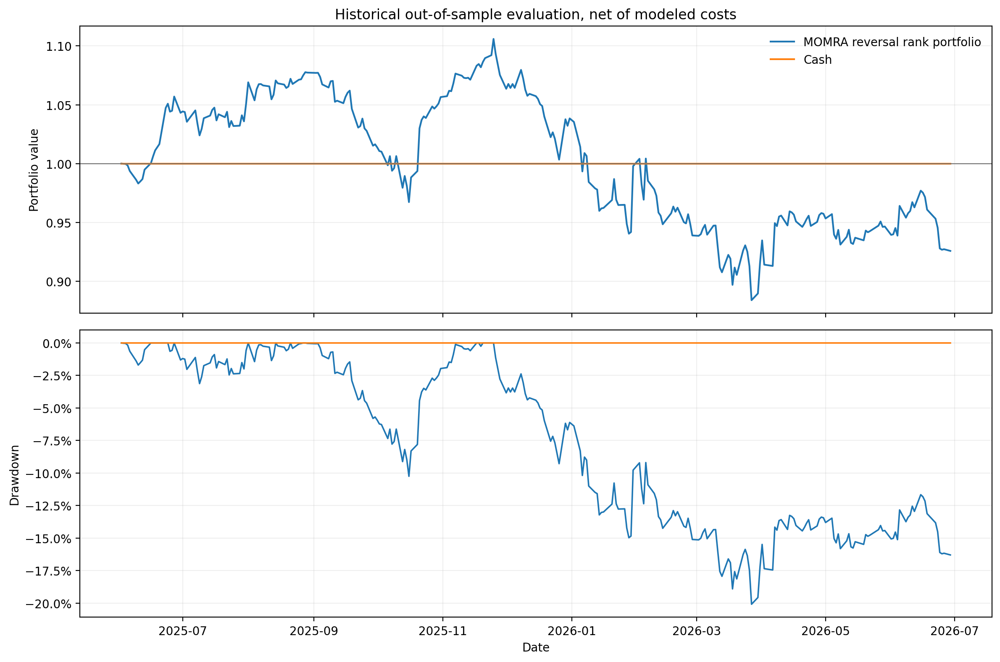
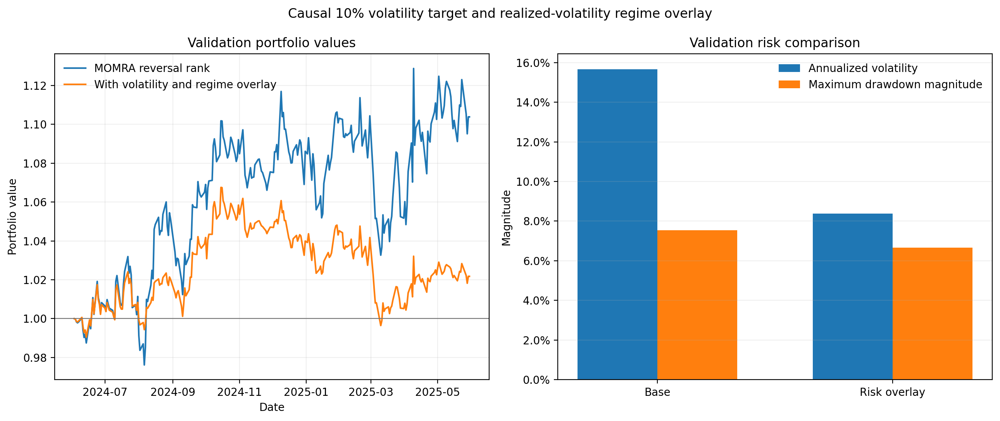

# CTA-Inspired Cross-Asset ETF Research

[](https://github.com/IsabellaChen70/etf-momentum-research/actions/workflows/tests.yml)

This repository documents a personal research project on systematic long-short signals across 37 exchange-traded funds. It progresses from signal diagnostics and cohort backtesting to walk-forward modeling, constrained portfolio construction, and a cost-aware deployment decision. The sample runs from January 2020 through June 2026.

## Research design

- Momentum is the mean of the prior 20 close-to-close daily returns.
- Risk-adjusted momentum, or MOMRA, divides that mean by its estimated standard error: `rolling_std / sqrt(20)`.
- A signal observed at close `t` enters at close `t+1`. Each position cohort earns the following five daily returns.
- Portfolio rules target 150% long exposure and 50% short exposure when both sides are available.

The chronological samples are training through May 2024, validation from June 2024 through May 2025, and a historical test beginning in June 2025. Model and parameter choices use only training or validation metrics defined in each stage. Historical test statistics are reported after selection. Since these results have now been inspected, this period should not be described as a fresh holdout in later research.

The exploratory stages exclude implementation costs. The final end-to-end pipeline applies 5 basis points of transaction cost and 25 basis points of annual short-borrow cost. Other financing costs, taxes, and distributions remain excluded. The estimates describe this dataset and implementation.

## Data treatment

The source panel contains daily OHLCV observations across six market categories. These categories cover broad US equities, US sectors, international equities, fixed income, commodities, and alternatives. Supplied adjusted files replace USO and UNG. Documented 2-for-1 splits in XLB, XLE, XLK, XLU, and XLY are corrected in the loader. Returns remain price returns because distributions are outside the dataset.

The input files are excluded from GitHub because their redistribution terms were not established. See [data/README.md](data/README.md) for the expected local paths.

## Initial portfolio comparison

| Portfolio | Allocation rule | Ending value | Annualized return | Annualized volatility | Return / volatility | Maximum drawdown |
| --- | --- | ---: | ---: | ---: | ---: | ---: |
| Equal sign groups | Positive signals share the long side; negative signals share the short side | 1.545 | 7.0% | 17.7% | 0.39 | -32.8% |
| Relative rank groups | Upper and lower halves of the daily ranking determine the two sides | 1.892 | 10.4% | 15.4% | 0.67 | -22.8% |

The relative-rank allocation had the stronger full-sample result. This comparison predates the stricter sample-selection stage and should be interpreted as exploratory.


## Signal diagnostics

MOM, MOMRA, rolling historical percentiles, and same-day cross-sectional ranks are compared with execution-aligned five-day returns. Validation averages generally decline as momentum rises. For example, the lowest MOM percentile group averaged 0.45% over the following five return-days, while the highest group averaged -0.01%. This supports testing a reversal direction in the next stage, although the relationship varies across samples.


## MACD comparison

The MACD stage compares normalized SMA signals, signal smoothing, and recursive EWMA variants. Validation Sharpe selects parameters.

| Strategy | Selected specification | Validation Sharpe | Historical test Sharpe |
| --- | --- | ---: | ---: |
| MOMRA reversal baseline | Signal-proportional | 0.813 | 1.255 |
| SMA MACD | Fast 1, slow 5 | 0.554 | -0.443 |
| Smoothed SMA candidate | Fast 10, slow 20, smoother 9 | -0.427 | 1.214 |
| EWMA MACD | Alpha 0.333 / 0.125, smoother 9 | -0.671 | 1.335 |

The unsmoothed SMA model beat every smoothed and EWMA candidate on validation. The later historical performance of the smoothed variants does not change that selection result. The reversal baseline had the strongest validation result among the strategies in this stage.


## Walk-forward modeling

Fourteen momentum-derived features feed a monthly walk-forward framework. Each fold uses three calendar months for fitting, one month for hyperparameter validation, and the next month for prediction. Rolling winsorization and scaling use only observations available before each signal date. The prediction target is the five-day return earned after the one-day execution lag.

The model comparison includes an equal-weight signal composite, regularized linear regressions, and tree-based regressors. Overall validation MSE selects the model family, with validation MAE as the tie-breaker.

| Validation rank | Model | MSE | MAE | Return correlation |
| ---: | --- | ---: | ---: | ---: |
| 1 | LASSO | 0.000935 | 0.020842 | -0.0210 |
| 2 | Elastic Net | 0.000935 | 0.020849 | -0.0225 |
| 3 | Equal Weight | 0.000937 | 0.020983 | -0.0033 |
| 4 | Ridge | 0.000946 | 0.021190 | -0.0017 |
| 5 | Gradient Boosting | 0.000949 | 0.021204 | 0.0120 |
| 6 | Random Forest | 0.000951 | 0.021180 | 0.0157 |

LASSO had the lowest validation MSE, though its advantage over Elastic Net and the equal-weight composite was small. Its validation return correlation was negative. This weak cross-sectional forecasting evidence limits how much weight should be placed on the backtested portfolio result. The selected LASSO portfolio returned 15.1% annualized during validation with 10.5% annualized volatility and a -9.1% maximum drawdown, before trading and financing costs.



The historical test results are retained for descriptive comparison because that period has already been inspected. They were not used in the validation ranking shown above and should not be treated as a fresh holdout.

## Portfolio optimization

The validation-selected LASSO forecasts provide expected returns for a constrained mean-variance optimizer. Risk is estimated from a trailing 60-day covariance matrix with 10% diagonal shrinkage. Candidate portfolios maintain 100% net exposure, subject to a 300% gross-exposure limit.

The risk-aversion parameter is selected by validation Sharpe. A value of 300 ranked first with a validation Sharpe of 0.773, narrowly ahead of 0.3 at 0.752. The selected portfolio had lower risk than the signal-proportional reference in the historical test, though its return and Sharpe were also lower.

| Historical test strategy | Annualized return | Annualized volatility | Sharpe | Maximum drawdown |
| --- | ---: | ---: | ---: | ---: |
| Mean-variance optimized | 3.4% | 3.4% | 1.002 | -3.2% |
| Signal-proportional reference | 13.0% | 11.4% | 1.122 | -5.1% |

LASSO produced identical cross-sectional forecasts on 164 of 270 historical test dates. Under the required 100% net constraint, the covariance estimate drives allocation on those dates. This makes the result partly a minimum-variance experiment and weakens any claim that return forecasts explain the performance.



## Final cost-aware evaluation

The final pipeline tightens the earlier experiments in several ways. Models predict execution-aligned cross-sectional relative returns using 12-month training windows and two-month inner validation windows. Portfolio construction is market neutral, allows cash when forecasts collapse, and limits each ETF to 15% absolute weight. Ledoit-Wolf covariance shrinkage replaces the earlier fixed shrinkage estimate. Backtests include transaction and short-borrow costs.

Elastic Net had the highest validation rank IC, though its mean daily rank IC was still -0.0069. Its optimized portfolio lost 16.1% annualized during validation after modeled costs. A deployment comparison therefore selected the MOMRA-reversal rank portfolio, which had a validation Sharpe of 0.716.

The frozen MOMRA-reversal portfolio did not generalize to the already-inspected historical test:

| Historical test result | Value |
| --- | ---: |
| Annualized return | -7.0% |
| Annualized volatility | 17.4% |
| Sharpe | -0.328 |
| Maximum drawdown | -20.1% |

This result changes the project’s conclusion. The earlier positive backtests were sensitive to portfolio construction and evaluation choices. With cross-sectional targets and market-neutral constraints, the tested signals did not provide stable historical out-of-sample performance after modeled costs. The research infrastructure remains useful, while the strategy evidence is insufficient for deployment.



## Validation-only risk overlay

A later risk-control extension adds a 10% ex-ante volatility target and a realized-volatility regime. The regime threshold uses only prior observations from a rolling 252-day history. Exposure is cut by half above the prior 80th-percentile threshold and is never scaled above the base strategy.

The extension is evaluated on validation only because the historical test had already been inspected. It reduced annualized volatility from 15.7% to 8.4% and reduced maximum drawdown magnitude from 7.5% to 6.7%. Annualized return fell from 10.6% to 2.2%, so this is evidence of risk reduction rather than improved forecasting or risk-adjusted performance.



Exact counts, constraints, and scope boundaries are recorded in [PROJECT_METRICS.md](PROJECT_METRICS.md).

## Reproduction

Create an environment with Python 3.11 or later and install the dependencies:

```bash
python3 -m pip install -r requirements.txt
```

After placing the local inputs under `data/`, run:

```bash
python3 src/explore_etf_data.py
python3 src/momentum_backtest.py
python3 -m src.signal_analysis
python3 -m src.macd_research
python3 -m src.rolling_lasso
python3 -m src.model_comparison
python3 -m src.portfolio_optimization
python3 scripts/run_research_pipeline.py
python3 scripts/run_risk_overlay_analysis.py
python3 -m pytest
```

Derived artifacts are written under `results/` and `reports/`.

## Repository layout

| Path | Contents |
| --- | --- |
| `src/explore_etf_data.py` | Data checks and descriptive plots |
| `src/momentum_backtest.py` | Signal construction and cohort backtester |
| `src/signal_analysis/` | MOM, MOMRA, percentile, and cross-sectional diagnostics |
| `src/macd_research.py` | SMA grid, smoothing comparison, and EWMA comparison |
| `src/rolling_lasso.py` | Forward-safe feature processing and rolling LASSO evaluation |
| `src/model_comparison.py` | Equal-weight, regression, and tree-model comparison |
| `src/portfolio_optimization.py` | Validation-selected constrained mean-variance optimization |
| `src/etf_research/` | End-to-end feature, model, portfolio, and reporting package |
| `src/etf_research/risk_overlay.py` | Causal volatility target and realized-volatility regime controls |
| `configs/research_pipeline.json` | Reproducible final-pipeline configuration |
| `scripts/run_risk_overlay_analysis.py` | Validation-only risk-overlay analysis and metric export |
| `tests/` | Look-ahead prevention, execution, constraint, and cost tests |
| `EVALUATION_POLICY.md` | Holdout and reporting policy |
| `PROJECT_METRICS.md` | Verified counts, results, and scope boundaries |
| `results/` | Compact research tables and figures |
| `reports/` | Final validation and historical evaluation artifacts |
