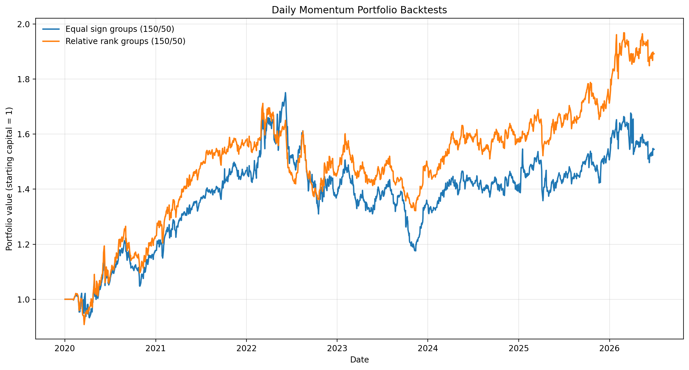
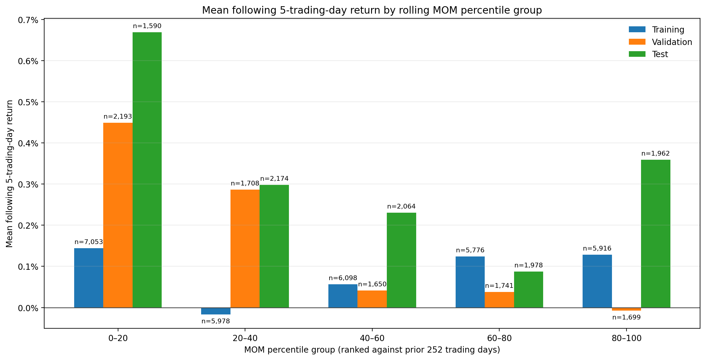
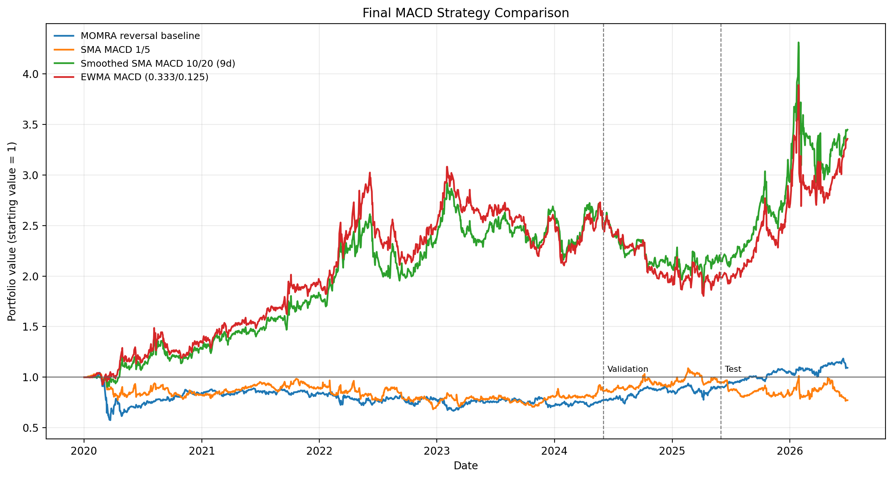

# ETF Momentum Research

This repository documents a personal research project on momentum signals across 37 exchange-traded funds. The current release covers price-panel validation, a multi-asset cohort backtester, grouped signal diagnostics, and MACD parameter comparisons. The sample runs from January 2020 through June 2026.

## Research design

- Momentum is the mean of the prior 20 close-to-close daily returns.
- Risk-adjusted momentum, or MOMRA, divides that mean by its estimated standard error: `rolling_std / sqrt(20)`.
- A signal observed at close `t` enters at close `t+1`. Each position cohort earns the following five daily returns.
- Portfolio rules target 150% long exposure and 50% short exposure when both sides are available.

The chronological samples are training through May 2024, validation from June 2024 through May 2025, and a historical test beginning in June 2025. Parameter choices use validation Sharpe. Historical test statistics are reported after selection. Since these results have now been inspected, this period should not be described as a fresh holdout in later research.

Transaction costs, financing costs, taxes, and distributions are excluded from the stages published here. The estimates describe this dataset and implementation.

## Data treatment

The source panel contains daily OHLCV observations. Supplied adjusted files replace USO and UNG. Documented 2-for-1 splits in XLB, XLE, XLK, XLU, and XLY are corrected in the loader. Returns remain price returns because distributions are outside the dataset.

The input files are excluded from GitHub because their redistribution terms were not established. See [data/README.md](data/README.md) for the expected local paths.

## Initial portfolio comparison

| Portfolio | Allocation rule | Ending value | Annualized return | Annualized volatility | Return / volatility | Maximum drawdown |
| --- | --- | ---: | ---: | ---: | ---: | ---: |
| Equal sign groups | Positive signals share the long side; negative signals share the short side | 1.545 | 7.0% | 17.7% | 0.39 | -32.8% |
| Relative rank groups | Upper and lower halves of the daily ranking determine the two sides | 1.892 | 10.4% | 15.4% | 0.67 | -22.8% |

The relative-rank allocation had the stronger full-sample result. This comparison predates the stricter sample-selection stage and should be interpreted as exploratory.



## Signal diagnostics

MOM, MOMRA, rolling historical percentiles, and same-day cross-sectional ranks are compared with execution-aligned five-day returns. Validation averages generally decline as momentum rises. For example, the lowest MOM percentile group averaged 0.45% over the following five return-days, while the highest group averaged -0.01%. This supports testing a reversal direction in the next stage, although the relationship varies across samples.



## MACD comparison

The MACD stage compares normalized SMA signals, signal smoothing, and recursive EWMA variants. Validation Sharpe selects parameters.

| Strategy | Selected specification | Validation Sharpe | Historical test Sharpe |
| --- | --- | ---: | ---: |
| MOMRA reversal baseline | Signal-proportional | 0.813 | 1.255 |
| SMA MACD | Fast 1, slow 5 | 0.554 | -0.443 |
| Smoothed SMA candidate | Fast 10, slow 20, smoother 9 | -0.427 | 1.214 |
| EWMA MACD | Alpha 0.333 / 0.125, smoother 9 | -0.671 | 1.335 |

The unsmoothed SMA model beat every smoothed and EWMA candidate on validation. The later historical performance of the smoothed variants does not change that selection result. The reversal baseline had the strongest validation result among the strategies in this stage.



## Reproduction

Create an environment with Python 3.11 or later and install the dependencies:

```bash
python3 -m pip install -r requirements.txt
```

After placing the local inputs under `data/`, run:

```bash
python3 src/explore_etf_data.py
python3 src/momentum_backtest.py
python3 -m src.signal_analysis
python3 -m src.macd_research
```

Derived tables and figures are written under `results/`.

## Repository layout

| Path | Contents |
| --- | --- |
| `src/explore_etf_data.py` | Data checks and descriptive plots |
| `src/momentum_backtest.py` | Signal construction and cohort backtester |
| `src/signal_analysis/` | MOM, MOMRA, percentile, and cross-sectional diagnostics |
| `src/macd_research.py` | SMA grid, smoothing comparison, and EWMA comparison |
| `results/` | Compact research tables and figures |
